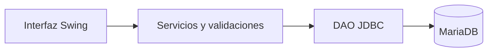

# Química Andina · Control de asistencia


Aplicación de escritorio para registrar jornadas laborales y consultar asistencia, atrasos y salidas anticipadas. Proyecto académico organizado en capas y preparado para ejecutarse fuera del equipo original.

## Funcionalidades

- Acceso por rol: administrador y trabajador.
- Marcación de entrada y salida con validación de duplicados y días hábiles.
- Gestión de trabajadores, áreas y turnos; desactivación sin borrar el historial.
- Reportes de asistencia, atrasos, salidas anticipadas e inasistencias.
- Contraseñas nuevas con PBKDF2 y migración automática del SHA-256 histórico al iniciar sesión.

## Arquitectura



`src/main/java` contiene interfaz, servicios, entidades y DAO. `src/test/java` verifica reglas sin base de datos; `database` contiene el esquema de demostración y una migración para instalaciones anteriores.

## Ejecutar en Windows

Requisitos: **JDK 25**, **MariaDB 10.4+** y **MySQL Connector/J 8.4.0**. Descarga el driver desde [MySQL](https://dev.mysql.com/downloads/connector/j/) y guarda `mysql-connector-j-8.4.0.jar` en `lib/`.

1. Importa `database/schema-demo.sql` en una instalación de demostración sin una base `sistema_asistencia` previa. El script no borra una base existente. Los usuarios incluidos son ficticios.
2. Crea un usuario de aplicación con permisos SELECT, INSERT, UPDATE y DELETE sobre esa base (DELETE se utiliza en la prueba de humo histórica).
3. Configura la conexión en PowerShell:

```powershell
$env:DB_URL = 'jdbc:mysql://localhost:3306/sistema_asistencia'
$env:DB_USER = 'asistencia'
$env:DB_PASSWORD = 'tu-clave-local'
./scripts/run.ps1
```

Cuenta demo: `admin@example.com` / `demo12345`. Trabajador: `empleado01@example.com` / `demo12345`. Son credenciales de demostración.

Para una base histórica, ejecuta primero `database/migrations/001_password_length.sql`; conserva sus datos y permite almacenar PBKDF2. Las cuentas SHA-256 se actualizan tras un login correcto.

## Verificaciones

```powershell
./scripts/test.ps1
```

La prueba histórica `PruebaHumo` modifica registros demo y requiere `ALLOW_DEMO_DB_TEST=true`; no forma parte del CI.

Las pruebas cubren fines de semana, duplicados, límites exactos de 09:30 y 17:30, salidas anteriores o iguales a la entrada y verificación de contraseñas. GitHub Actions ejecuta las mismas pruebas sin conexión a MySQL.

## Mejoras incorporadas

- Conexión por variables de entorno, sin rutas personales ni `root` como valor predeterminado.
- Compilación separada de las fuentes y scripts reproducibles.
- Validación de salida posterior a entrada y actualización condicional para impedir que dos peticiones sobrescriban una salida.
- Contraseñas con sal aleatoria y migración compatible.
- Esquema de demostración sin eliminación automática de bases y sin datos personales originales.

## Alcance y próximos pasos

Conserva las reglas del caso académico: lunes a viernes, atraso después de 09:30 y salida anticipada antes de 17:30. Los reportes también consideran turnos; unificar ambas reglas por turno es una mejora pendiente. No modela feriados ni turnos nocturnos. Las consultas JDBC de la interfaz siguen siendo síncronas: con una base remota, conviene incorporar `SwingWorker`.

Autor del repositorio: [Sokir1](https://github.com/Sokir1). Proyecto de portafolio y aprendizaje; conserva la procedencia académica del código.
